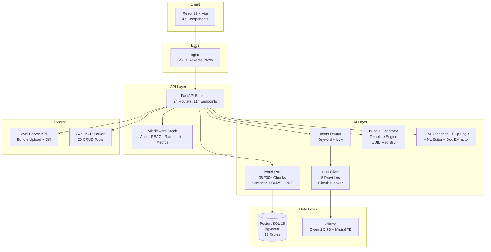

# Avni AI Platform


A self-hosted AI orchestration platform for [Avni](https://avniproject.org) -- the open-source community health and field data collection system. The platform provides a conversational AI interface backed by domain-specific RAG retrieval over 36,700+ knowledge chunks from 18 production implementations, enabling NGOs to configure, deploy, and troubleshoot Avni implementations through natural language.

The default deployment runs entirely self-hosted -- Ollama for LLM inference, sentence-transformers for embeddings, pgvector for retrieval -- with zero cloud dependencies and no data leaving the server.

---

## Key Features

- **Conversational AI** -- Intent-aware chat with 6-layer system prompt, skill-based RAG retrieval, action detection, and SSE streaming
- **Bundle Generation** -- SRS (text, JSON, Excel) to production-ready Avni implementation bundle with zero LLM dependency on the critical path
- **Hybrid RAG Search** -- pgvector semantic search + PostgreSQL BM25, fused via Reciprocal Rank Fusion across 14 knowledge collections
- **5 LLM Providers** -- Ollama (self-hosted), Groq, Cerebras, Gemini, Anthropic with per-provider circuit breaker and automatic failover
- **Natural Language Bundle Editor** -- Apply corrections to generated bundles using plain English
- **LLM Reasoner** -- 60+ field property rules for automatic inference of units, ranges, and validation constraints
- **Skip Logic Generator** -- Convert showWhen/hideWhen declarations to production JavaScript rules
- **Document Extractor** -- Structure, map, and clarify pipeline for raw documents to Avni domain models
- **Rule Engine** -- Generate, test, and validate JavaScript rules (skip logic, visit scheduling, decisions, validations)
- **Voice & Image** -- Map voice transcripts to form fields; extract structured data from images via vision models
- **5 Domain Templates** -- MCH, Nutrition, WASH, Education, Livelihoods -- pre-built and customisable
- **NGO Support** -- 7 troubleshooting flows, 40+ FAQs, quick symptom-based diagnosis
- **RBAC** -- 4 hierarchical roles, 26 permissions, JWT + API key auth, prompt injection detection
- **Production Infrastructure** -- Docker Compose (8 services), nginx SSL, Prometheus + Grafana, automated PostgreSQL backups
- **438 Passing Tests** -- Comprehensive coverage across all subsystems
- **MCP Integration** -- 20 CRUD tools via Avni MCP Server for real-time entity management
- **ReAct Agent** -- Multi-step autonomous task execution with human-in-the-loop confirmation
- **Personalisation** -- Custom instructions, org memory, saved prompts, suggested prompts, chat history search

---

## Quick Start

```bash
# 1. Clone and start infrastructure
git clone <repo-url> && cd avni-ai-platform
docker compose up -d

# 2. Create custom Ollama models
ollama create avni-coder -f backend/Modelfile.avni-coder
ollama create avni-chat -f backend/Modelfile.avni-chat

# 3. Ingest the knowledge base (36,700+ chunks)
cd backend && source .venv/bin/activate
python scripts/ingest_all_knowledge.py

# 4. Start the backend
uvicorn app.main:app --reload --port 8080

# 5. Start the frontend
cd ../frontend && npm install && npm run dev
```

Open `http://localhost:5173` to start chatting. API docs are at `http://localhost:8080/docs`.

---

## Architecture



---

## Documentation

| Document | Description |
|----------|-------------|
| **[Architecture](docs/ARCHITECTURE.md)** | System design with mermaid diagrams: component topology, request lifecycle, data model (ER), RAG pipeline, bundle pipeline, deployment architecture |
| **[API Reference](docs/API_REFERENCE.md)** | All 114 endpoints across 23 domain groups with request/response examples |
| **[Deployment Guide](docs/DEPLOYMENT.md)** | Production Docker Compose (8 services), environment variables, SSL, monitoring, backups, troubleshooting |
| **[Developer Guide](docs/DEVELOPER_GUIDE.md)** | Local setup, project structure, adding endpoints/collections/providers, 438-test suite, code conventions |
| **[Security](docs/SECURITY.md)** | Auth flow, RBAC with 4 roles and 26 permissions, rate limiting, circuit breaker, responsible AI guardrails, PII handling, audit trail |

---

## Tech Stack

| Layer | Technology |
|-------|-----------|
| **Backend** | Python 3.14, FastAPI, Uvicorn, asyncpg, Pydantic v2 |
| **Frontend** | React 19, Vite 7, TypeScript 5.9, Tailwind CSS v4 |
| **Database** | PostgreSQL 16 + pgvector (HNSW + GIN indexes) |
| **LLM Inference** | Ollama (Qwen 2.5 Coder 7B q4_K_M, Mistral 7B q4_K_M, LLaVA 7B) |
| **Cloud LLM Fallbacks** | Groq (Llama 3.3 70B), Cerebras (Llama 3.3 70B), Gemini 2.0 Flash, Claude Sonnet |
| **Embeddings** | sentence-transformers (all-MiniLM-L6-v2, 384 dimensions, local) |
| **RAG** | Hybrid search: cosine similarity (HNSW) + BM25 (GIN tsvector) + RRF fusion |
| **Auth** | JWT (HS256, 24h access / 30d refresh) + API key auth + bcrypt |
| **Monitoring** | Prometheus + Grafana (provisioned dashboards and datasources) |
| **Reverse Proxy** | nginx 1.27 + Let's Encrypt (Certbot auto-renewal) |
| **Containers** | Docker Compose: 8 production services with health checks and resource limits |
| **Backup** | postgres-backup-local (daily, 30d/4w/6m retention) |

---

## Knowledge Corpus

| Collection | Chunks | Source |
|------------|--------|--------|
| org_bundles | 20,296 | 17 organisation implementation bundles |
| concepts | 4,949 | Concept definitions across MCH, WASH, Education, Nutrition, Livelihoods |
| srs_examples | 4,386 | 66 SRS Excel files from 20 organisations |
| skills | 3,210 | 108 skill documents from avni-skills |
| etl_code | 1,604 | avni-etl codebase |
| server_code | 1,315 | avni-server codebase |
| webapp_code | 326 | avni-webapp codebase |
| forms | 280 | Production form definitions |
| client_code | 141 | avni-client (Android) codebase |
| rules | 132 | Rule templates and examples |
| transcripts | 52 | Training session transcripts |
| knowledge | 17 | Domain knowledge articles |
| support | 9 | Support patterns |
| **Total** | **36,717** | **14 collections** |

---

## Production Deployment

```bash
# Set required environment variables
cp .env.production.example .env
vi .env  # DB_PASSWORD, API_KEYS, JWT_SECRET, GRAFANA_PASSWORD

# Launch all 8 services
docker compose -f docker-compose.prod.yml up -d --build

# Ingest knowledge base
docker compose -f docker-compose.prod.yml exec backend \
  python scripts/ingest_all_knowledge.py

# Verify
curl https://ai.avniproject.org/api/health
```

See [Deployment Guide](docs/DEPLOYMENT.md) for SSL setup, monitoring configuration, and backup management.

---

## Contributing

1. Fork the repository
2. Create a feature branch from `main`
3. Run the test suite: `cd backend && pytest`
4. Open a pull request with a clear description

See [Developer Guide](docs/DEVELOPER_GUIDE.md) for local setup, project structure, and code conventions.

---

## License

AGPL-3.0
